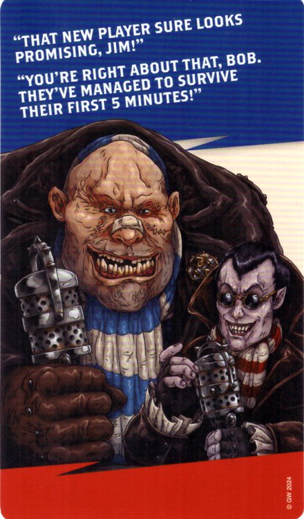

## Rookies to Watch

If you are an experienced Blitz Bowl Coach and introducing someone new to the game, give them this card during set-up.

*"Well Jim, it looks like these rookies are ones to keep an eye on!"*

*"That's right Bob, they've got the hustle of an expert team, despite being green around the ears. I can't wait to see what they can do on the gridiron!"*

*"Well Jim, as long as it's plenty violent, I'm happy!"*

*"You would be Bob, you would be."*

**Raw Talent**

Discard this card after you make an Armour Check, a Throw Check, or roll the Block Dice for a Block Action made by a Player from your team. Re-roll the dice.

---

## Challenge and Bonus Play Cards

| Challenge      | 🛡️ | Bonus Play            |
|---------------------|:---:|----------------------|
| [BREAK SOME BONES!](#break-some-bones) | 3 | [RAW TALENT](#raw-talent) |
| [BREAK SOME BONES!](#break-some-bones) | 3 | [STEP ASIDE](#step-aside) |
| [FREE UP THE BALL!](#free-up-the-ball) | 2 | [BLITZ!](#blitz) |
| [FREE UP THE BALL!](#free-up-the-ball) | 2 | [INTERVENTION](#intervention) |
| [GET MOVING!](#get-moving) | 2 | [AGGRESSIVE MARK](#aggressive-mark) |
| [GET MOVING!](#get-moving) | 2 | [SPRINT](#sprint) |
| [GET THE BALL!](#get-the-ball) | 1 | [SHADOWING](#shadowing) |
| [GET THE BALL!](#get-the-ball) | 1 | [STEP ASIDE](#step-aside) |
| [GET TOGETHER!](#get-together) | 1 | [RESERVES](#reserves) |
| [MAKE A RISKY THROW!](#make-a-risky-throw) | 2 | [ACCURATE THROW](#accurate-throw) |
| [MOVE THE BALL!](#move-the-ball) | 1 | [DODGE](#dodge) |
| [MOVE THE BALL!](#move-the-ball) | 1 | [RAW TALENT](#raw-talent) |
| [PLAY AS A TEAM!](#play-as-a-team) | 2 | [AGGRESSIVE MARK](#aggressive-mark) |
| [PLAY AS A TEAM!](#play-as-a-team) | 2 | [INSPIRATION](#inspiration) |
| [PLAY AS A TEAM!](#play-as-a-team) | 2 | [TOUGH ENOUGH](#tough-enough) |
| [SHOW NO FEAR!](#show-no-fear) | 2 | [JUMP UP](#jump-up) |
| [SHOW THEM HOW IT'S DONE!](#show-them-how-its-done) | 2 | [BLADED KNUCKLE DUSTERS](#bladed-knuckle-dusters) |
| [SHOW THEM HOW IT'S DONE!](#show-them-how-its-done) | 2 | [THE KID'S GOT MOXY](#the-kids-got-moxy) |
| [SHOW US A COMPLETION!](#show-us-a-completion) | 1 | [INSPIRATION](#inspiration) |
| [SHOW US A COMPLETION!](#show-us-a-completion) | 1 | [NERVES OF STEEL](#nerves-of-steel) |
| [SHOWBOAT FOR THE CROWD!](#showboat-for-the-crowd) | 1 | [HAIL MARY PASS](#hail-mary-pass) |
| [SPREAD OUT!](#spread-out) | 1 | [RESERVES](#reserves) |
| [TAKE THEM DOWN!](#take-them-down) | 2 | [BLOCKING PLAY](#blocking-play) |
| [TAKE THEM DOWN!](#take-them-down) | 2 | [DIVING TACKLE](#diving-tackle) |
| [TIE THEM UP!](#tie-them-up) | 2 | [DEFENSIVE PLAY](#defensive-play) |
| [TIE THEM UP!](#tie-them-up) | 2 | [RAW TALENT](#raw-talent) |

---

## Challenge Cards

### BREAK SOME BONES!
[🛡️ **3**]
Claim this card if a Player from your team made a Block Action or a Foul Action and the target was Injured.

### FREE UP THE BALL!
[🛡️ **2**]
Claim this card if an Opposition Player has possession of a ball, and after a Player from your team makes an Action, their team no longer has possession of that ball.

### GET MOVING!
[🛡️ **2**]
Claim this card if a Player from your team made a Run Action, and your team has made three or more Run Actions during your turn.

### GET THE BALL!
[🛡️ **1**]
Claim this card if a Player from your team took possession of a ball, and your team did not have possession of that ball at the start of your turn.

### GET TOGETHER!
[🛡️ **1**]
Claim this card if a Player from your team made a Run, Mark, or Sidestep Action, and that Player is adjacent to two or more Team-mates.

### MAKE A RISKY THROW!
[🛡️ **2**]
Claim this card if a Player from your team made a successful Throw Action, and there was a negative modifier on the Throw Check.

### MOVE THE BALL!
[🛡️ **1**]
Claim this card if a Player from your team made a Throw Action or a Run Action, and during that Action, a ball was moved 4 or more squares further away from your team's End Zone, and a Player from your team still has possession of that ball.

### PLAY AS A TEAM!
[🛡️ **2**]
Claim this card if you made three or more different Actions with three or more different Players during your turn.

### SHOW NO FEAR!
[🛡️ **2**]
Claim this card if a Player from your team ends an Action on a Trapdoor, and an Opposition Player has possession of a ball.

### SHOW THEM HOW IT'S DONE!
[🛡️ **2**]
Claim this card if a Player from your team made an Action, and that Player has made three or more different Player Actions (not free Actions) during your turn.

### SHOW US A COMPLETION!
[🛡️ **1**]
Claim this card if a Player on your team made a Throw Action (not a Hand-off), and that Throw Action was successful.

### SHOWBOAT FOR THE CROWD!
[🛡️ **1**]
Claim this card if a Player from your team made an Action that resulted in your team scoring a Touchdown.

### SPREAD OUT!
[🛡️ **1**]
Claim this card after a Player from your team makes a Run or Sidestep Action, and there are no Players from your team adjacent to one or more Team-mates.

### TAKE THEM DOWN!
[🛡️ **2**]
Claim this card if a Player from your team made a Block Action and the target was Knocked Down.

### TIE THEM UP!
[🛡️ **2**]
Claim this card if a Player from your team made a Mark Action, and is now Marking two or more Opposition Players who are not Marked by any other Players from your team.

---

## Bonus Play Cards

### ACCURATE THROW
Play this card before a Player from your team makes a Throw Action. Treat the throwing Player as having a Throw value of 2+ for that Throw Action.

### AGGRESSIVE MARK
Play this card before a Player from your team makes a Mark Action. For that Action only, they can move up to 4 squares instead of 2.

### BLADED KNUCKLE DUSTERS
Play this card after an Opposition Player is Knocked Down as a result of a Block Action. The Opposition Player's Armour Value is 6+ for this Armour Check.

### BLITZ!
Play this card after a Player from your team makes a Mark Action and has already made a Run Action this turn. That Player may make a free Block Action that targets an Opposition Player they are Marking.

### BLOCKING PLAY
Play this card at the start of your turn, before the Pre-Turn Sequence. Block Actions made by Players from your team this turn count as being Assisted.

### DEFENSIVE PLAY
Play this card after the Pre-Turn Sequence of your turn, but before making your first Player Action. Players from your team can move adjacent to Opposition Players when making a Run Action, but doing so immediately ends that Run Action.

### DIVING TACKLE
Play this card after a Player from your team makes a Mark Action. That Player may make a free Block Action. After making the Block Action, place your Player Prone but do not make an Armour Check for them.

### DODGE
Play this card before you make a Run Action with a Player from your team. For that Run Action, the Player can move adjacent to Opposition Players, but must still end the move Open.

### HAIL MARY PASS
Play this card when a Player from your team makes a Throw Action (not a Throw Team-mate Action). The target can be a Player from your team anywhere on the board, and the Throw Check will succeed on a roll of 4 or more. No modifiers apply to this Throw Check.

### INSPIRATION
Play this card after the Claim Challenge Card Step of your third Player Action. You may take a fourth Player Action. This Action still counts as part of your turn and follows all the rules for Actions and claiming Challenge Cards.

### INTERVENTION
Play this card to Interrupt after an Opposition Player makes a Run Action. Pick one Open Player from your team. That Player may make a free Mark Action, but must finish that Action adjacent to the Opposition Player that made the Run Action.

### JUMP UP
Pick a Prone Player from your team. That Player may make a free Stand Up Action.

### NERVES OF STEEL
Play this card before making a Player Action. For that Action only, a Player from your team can make a Throw Action even if they are Marked (including a Throw Team-mate Action).

### RAW TALENT
Play this card after you make an Armour Check, a Throw Check, or roll the Block Dice for a Block Action made by a Player on your team. Re-roll the dice.

### RESERVES
Play this card before making a Player Action. One Player in your Dugout may make a free Reserves Action.

### SHADOWING
Play this card to Interrupt an Opposition Player's Sidestep Action. Pick a Player from your team that was Marking that Opposition Player before the Sidestep Action was taken. Move your Player adjacent to the Opposition Player and into the square the Opposition Player moved out of.

### SPRINT
Play this card before you make a Run Action with a Player from your team. For that Run Action, increase the Player's Move Value by 2.

### STEP ASIDE
Play this card to Interrupt after an Opposition Player makes a Mark Action. Pick one Player from your team that is being Marked by that Opposition Player. That Player may make a free Sidestep Action.

### THE KID'S GOT MOXY
Play this card when a Player from your team makes a Block Action, and that Block Action is not assisted. Roll 3 Block Dice for that Block Action.

### TOUGH ENOUGH
Play this card to Interrupt after a Player from your team is chosen as the target of a Block Action, before the Block Dice are rolled. The Opposition Player's Block Action cannot be Assisted and will treat results of Shove as Miss.

---

## Random Events Cards

| Random Event |
|------------------------------|
| [BANANA SKINS](#banana-skins) |
| [CRUMBLING ASTROGRANITE PITCH](#crumbling-astrogranite-pitch) |
| [EMPTY THE BENCH](#empty-the-bench) |
| [GENEROUS COACHES](#generous-coaches) |
| [GET THE REF!](#get-the-ref) |
| [IMPATIENT COACHES](#impatient-coaches) |
| [IMPATIENT COACHES](#impatient-coaches) |
| [MULTI-BALL](#multi-ball) |
| [MULTI-BALL](#multi-ball) |
| [PITCH INVASION](#pitch-invasion) |
| [RESET](#reset) |
| [TRAPDOOR MONSTER](#trapdoor-monster) |

### BANANA SKINS
Each Coach chooses one Standing (but not Marked) Opposition Player, if any. The chosen Player becomes Prone (do not roll an Armour Check). If they were holding a ball, it will Bounce.

### CRUMBLING ASTROGRANITE PITCH
For the remainder of the game, when any Player would make an Armour Check as the result of a Block Action, a -1 modifier applies to that Armour Check. Place this card next to the pitch as a reminder.

### EMPTY THE BENCH
All Reserves Players may make a free Reserves Action.

### GENEROUS COACHES
For the remainder of the game, whenever a Challenge Card is claimed or a Touchdown is scored, the team scores 1 additional point. Place this card next to the pitch as a reminder.

### GET THE REF!
For the remainder of the game, Players making a Foul Action treat the Spotout result as Slipped and the Take That! result as Got Them! Place this card next to the pitch as a reminder.

### IMPATIENT COACHES
Discard all Active Challenge Cards. Then deal three new Challenge Cards from the Challenge Card Deck.

### MULTI-BALL
If there is a ball in play, one new ball comes into play. If there is no ball in play, two new balls come into play. Follow the rules for 'New Ball!' and 'Multiple Balls in Play'.

### PITCH INVASION
Each Coach rolls a Block Dice for each Standing, Marked or Prone Player from the opposing team. If a Krumhorn is rolled for an opposing Player, they are Injured and placed in the Dugout. If they were holding a ball, it will Bounce. Any other roll has no effect.

### RESET
Starting with the Coach whose turn it is, both Coaches remove all Players on the pitch and in the Dugout and place them in the End Zone following the rules for setting up the game. Play continues with the Coach whose turn it is when this event was revealed.

### TRAPDOOR MONSTER
Choose a random trapdoor. Any Player standing on that trapdoor is injured. Each Standing or Marked Player adjacent to that Trapdoor becomes Prone (no Armour Check). If any of these Players were holding a ball, it will Bounce.
